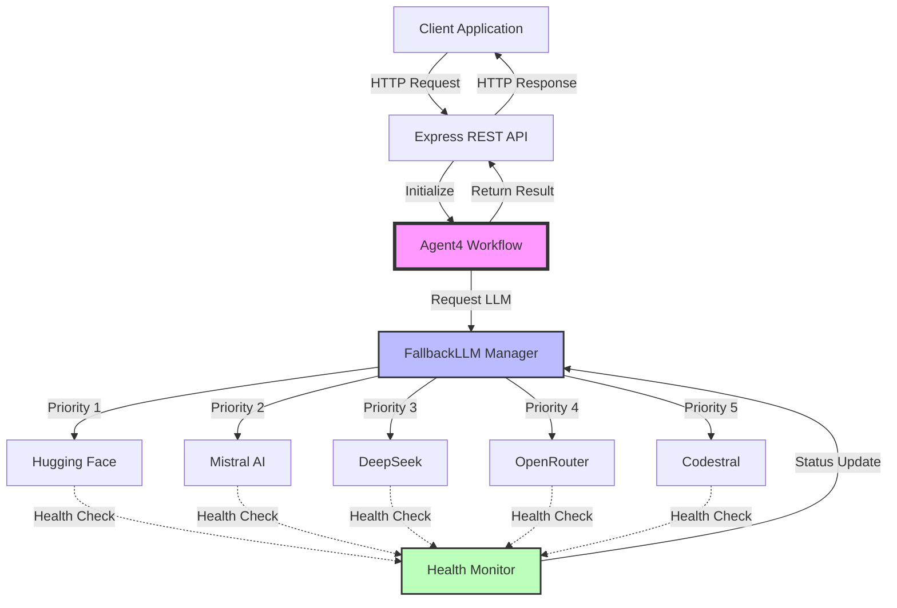
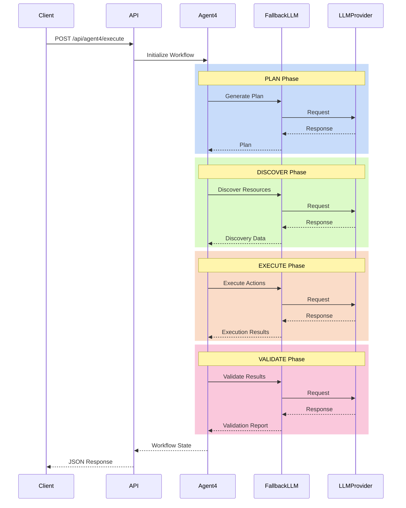
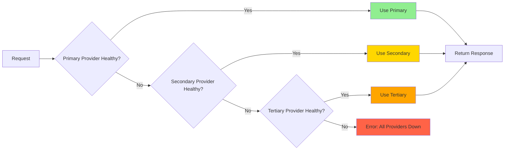
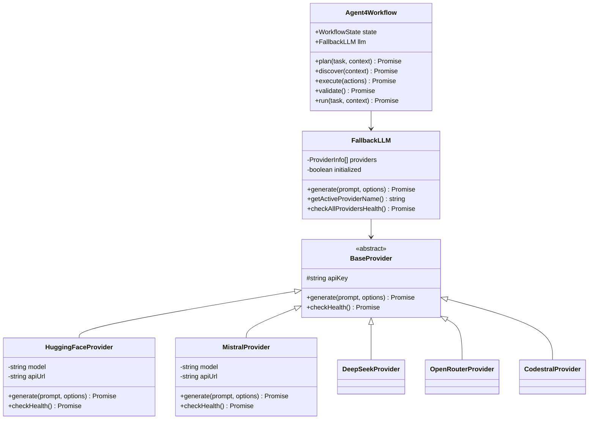
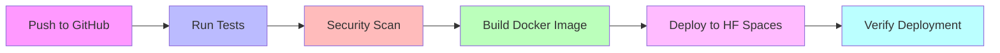

# 🤖 Agent4 Multi-LLM Implementation

<div align="center">

[](https://github.com/your-username/agent4-implementation/actions)
[](https://opensource.org/licenses/MIT)
[](https://www.typescriptlang.org/)
[](https://nodejs.org/)
[](https://www.docker.com/)
[](https://huggingface.co/)

**A production-ready, enterprise-grade multi-LLM AI agent framework with automatic fallback, health monitoring, and workflow orchestration.**

[Features](#-features) •
[Quick Start](#-quick-start) •
[Architecture](#-architecture) •
[API Reference](#-api-reference) •
[Deployment](#-deployment)

</div>

---

## 📋 Table of Contents

- [Overview](#-overview)
- [Features](#-features)
- [Architecture](#-architecture)
- [Quick Start](#-quick-start)
- [Configuration](#-configuration)
- [API Reference](#-api-reference)
- [LLM Providers](#-llm-providers)
- [Deployment](#-deployment)
- [Testing](#-testing)
- [Security](#-security)
- [Performance](#-performance)
- [Troubleshooting](#-troubleshooting)
- [Contributing](#-contributing)
- [License](#-license)

## 🎯 Overview

Agent4 is a robust, production-ready TypeScript framework for building autonomous AI agents with seamless integration across multiple LLM providers. Built with enterprise requirements in mind, it provides automatic failover, health monitoring, and a flexible workflow engine.

### Key Highlights

- ✅ **Multi-Provider Support**: Hugging Face, Mistral, DeepSeek, OpenRouter, Codestral
- ✅ **Automatic Fallback**: Seamless failover when primary LLM fails
- ✅ **Health Monitoring**: Real-time provider health checks
- ✅ **Type-Safe**: Full TypeScript implementation
- ✅ **Docker Ready**: Production-optimized containerization
- ✅ **CI/CD Integrated**: Automated testing and deployment
- ✅ **Security First**: Built-in secret scanning and vulnerability checks

## ✨ Features

### Core Capabilities

| Feature | Description |
|---------|-------------|
| **Multi-LLM Support** | Integrate multiple LLM providers with a unified interface |
| **Automatic Fallback** | Intelligent failover mechanism ensures continuous operation |
| **Workflow Engine** | 4-phase workflow: PLAN → DISCOVER → EXECUTE → VALIDATE |
| **Health Monitoring** | Continuous health checks for all LLM providers |
| **REST API** | Easy-to-use HTTP API for seamless integration |
| **TypeScript** | Full type safety and excellent developer experience |
| **Docker Support** | Production-ready containerization |
| **Security Scanning** | Integrated vulnerability and secret detection |

## 🏗️ Architecture

### System Architecture



### Workflow Execution Flow



### Fallback Mechanism



### Component Structure



## 🚀 Quick Start

### Prerequisites

- Node.js 18 or higher
- npm or yarn
- At least one LLM provider API key

### Installation

```bash
# Clone the repository
git clone https://github.com/your-username/agent4-implementation.git
cd agent4-implementation

# Install dependencies
npm install

# Copy environment template
cp .env.example .env

# Edit .env with your API keys
nano .env
```

### Environment Setup

```bash
# Required: At least one provider
HF_TOKEN=your_huggingface_token_here
MISTRAL_API_KEY=your_mistral_api_key_here
DEEPSEEK_API_KEY=your_deepseek_api_key_here
OPENROUTER_API_KEY=your_openrouter_api_key_here
CODESTRAL_API_KEY=your_codestral_api_key_here

# Configuration
DEFAULT_LLM_PROVIDER=huggingface
FALLBACK_ORDER=huggingface,mistral,deepseek,openrouter,codestral
NODE_ENV=development
PORT=3000
```

### Running the Server

**Development Mode:**
```bash
npm run dev
```

**Production Mode:**
```bash
npm run build
npm start
```

**Docker:**
```bash
docker build -t agent4-implementation .
docker run -p 3000:3000 --env-file .env agent4-implementation
```

## ⚙️ Configuration

### Environment Variables

| Variable | Required | Default | Description |
|----------|----------|---------|-------------|
| `NODE_ENV` | No | `development` | Environment mode |
| `PORT` | No | `3000` | Server port |
| `DEFAULT_LLM_PROVIDER` | No | `huggingface` | Primary LLM provider |
| `FALLBACK_ORDER` | No | Auto | Provider fallback order |
| `HF_TOKEN` | Yes* | - | Hugging Face API token |
| `MISTRAL_API_KEY` | Yes* | - | Mistral AI API key |
| `DEEPSEEK_API_KEY` | Yes* | - | DeepSeek API key |
| `OPENROUTER_API_KEY` | Yes* | - | OpenRouter API key |
| `CODESTRAL_API_KEY` | Yes* | - | Codestral API key |

\* At least one provider API key is required

## 📡 API Reference

### Health Check

**Endpoint:** `GET /health`

**Response:**
```json
{
  "status": "ok",
  "timestamp": "2024-10-10T06:31:53.000Z",
  "environment": "production"
}
```

### Execute Agent Workflow

**Endpoint:** `POST /api/agent4/execute`

**Request:**
```json
{
  "task": "Analyze the user requirements and create a project plan",
  "context": {
    "project": "E-commerce Platform",
    "deadline": "2024-12-31"
  }
}
```

**Response:**
```json
{
  "success": true,
  "data": {
    "plan": "...",
    "discovery": {...},
    "execution": {...},
    "validation": {...},
    "metadata": {
      "startTime": 1728540713000,
      "endTime": 1728540745000,
      "provider": "huggingface",
      "stepsCompleted": ["plan", "discover", "execute", "validate"]
    }
  }
}
```

**Error Response:**
```json
{
  "success": false,
  "error": "Task is required"
}
```

## 🔌 LLM Providers

### Supported Providers

| Provider | Models | Strengths | Configuration |
|----------|--------|-----------|---------------|
| **Hugging Face** | Mistral-7B, Llama-2, etc. | Open-source, flexible | `HF_TOKEN` |
| **Mistral AI** | Mistral Small, Medium, Large | Fast, efficient | `MISTRAL_API_KEY` |
| **DeepSeek** | DeepSeek Coder | Code generation | `DEEPSEEK_API_KEY` |
| **OpenRouter** | Multiple models | Model aggregator | `OPENROUTER_API_KEY` |
| **Codestral** | Codestral Latest | Code completion | `CODESTRAL_API_KEY` |

### Adding a New Provider

1. Create a new provider class in `src/llm/providers/`:

```typescript
import { BaseProvider } from './base';

export class NewProvider extends BaseProvider {
  async generate(prompt: string, options: any = {}): Promise<string> {
    // Implementation
  }
  
  async checkHealth(): Promise<boolean> {
    // Implementation
  }
}
```

2. Export it in `src/llm/providers/index.ts`
3. Add configuration in `src/llm/fallback.ts`
4. Update environment variables

## 📦 Deployment

### Docker Deployment

```bash
# Build image
docker build -t agent4:latest .

# Run container
docker run -d \
  -p 3000:3000 \
  -e HF_TOKEN=your_token \
  -e MISTRAL_API_KEY=your_key \
  --name agent4 \
  agent4:latest
```

### Hugging Face Spaces

1. **Prepare Repository:**
```bash
git clone https://github.com/your-username/agent4-implementation.git
cd agent4-implementation
```

2. **Add Secrets in HF Space Settings:**
   - `HF_TOKEN`
   - `MISTRAL_API_KEY`
   - `DEEPSEEK_API_KEY`
   - `OPENROUTER_API_KEY`
   - `CODESTRAL_API_KEY`

3. **Push to HF Spaces:**
```bash
git remote add hf https://huggingface.co/spaces/your-username/agent4-implementation
git push hf main
```

### CI/CD Pipeline

The project includes a comprehensive CI/CD pipeline:



## 🧪 Testing

### Run Tests

```bash
# Run all tests
npm test

# Run with coverage
npm test -- --coverage

# Run specific test suite
npm test -- providers

# Watch mode
npm test -- --watch
```

### Test Coverage

```bash
npm run test:coverage
```

Expected coverage:
- Statements: > 80%
- Branches: > 75%
- Functions: > 80%
- Lines: > 80%

## 🔒 Security

### Security Features

- ✅ No hardcoded secrets
- ✅ Automated secret scanning (TruffleHog)
- ✅ Vulnerability scanning (Trivy)
- ✅ SARIF security reports
- ✅ Read-only root filesystem in Docker
- ✅ Non-root user execution
- ✅ Dropped capabilities in containers

### Security Scanning

```bash
# Run Trivy scanner
docker run --rm -v $(pwd):/scan aquasec/trivy fs /scan

# Run secret detection
docker run --rm -v $(pwd):/scan trufflesecurity/trufflehog filesystem /scan
```

## ⚡ Performance

### Benchmarks

| Metric | Value | Notes |
|--------|-------|-------|
| Avg Response Time | 2-5s | Depends on LLM provider |
| Fallback Time | <1s | Provider switch time |
| Health Check Interval | 5min | Configurable |
| Max Concurrent Requests | 100 | Rate limited |

### Optimization Tips

1. **Use faster models** for simple tasks
2. **Enable caching** for repeated queries
3. **Adjust timeout** values based on needs
4. **Use load balancing** for high traffic

## 🐛 Troubleshooting

### Common Issues

**Issue: "No valid LLM providers could be initialized"**
```bash
# Solution: Check your API keys
echo $HF_TOKEN
echo $MISTRAL_API_KEY
# Verify keys are not empty and valid
```

**Issue: "All providers failed to generate a response"**
```bash
# Check provider health
curl http://localhost:3000/health
# Review logs for specific errors
docker logs agent4
```

**Issue: Build fails with TypeScript errors**
```bash
# Clear build cache
rm -rf dist node_modules
npm install
npm run build
```

## 🤝 Contributing

We welcome contributions! Please see our [Contributing Guide](CONTRIBUTING.md) for details.

### Development Workflow

1. Fork the repository
2. Create a feature branch
3. Make your changes
4. Add tests
5. Run linting and tests
6. Submit a pull request

```bash
# Setup
git clone https://github.com/your-username/agent4-implementation.git
cd agent4-implementation
npm install

# Create branch
git checkout -b feature/your-feature

# Development
npm run dev

# Testing
npm test
npm run lint

# Commit
git add .
git commit -m "feat: your feature description"
git push origin feature/your-feature
```

## 📄 License

This project is licensed under the MIT License - see the [LICENSE](LICENSE) file for details.

## 🙏 Acknowledgements

- [Model Context Protocol](https://modelcontextprotocol.io/)
- [Hugging Face](https://huggingface.co/)
- [Mistral AI](https://mistral.ai/)
- [DeepSeek](https://www.deepseek.com/)
- [OpenRouter](https://openrouter.ai/)
- [Codestral](https://mistral.ai/news/codestral/)

## 📞 Support

- 📧 Email: support@agent4.dev
- 💬 Discord: [Join our community](https://discord.gg/agent4)
- 🐛 Issues: [GitHub Issues](https://github.com/your-username/agent4-implementation/issues)
- 📚 Docs: [Full Documentation](https://docs.agent4.dev)

---

<div align="center">

Made with ❤️ by the Agent4 Team

[](https://github.com/your-username/agent4-implementation)
[](https://twitter.com/agent4dev)

</div>
